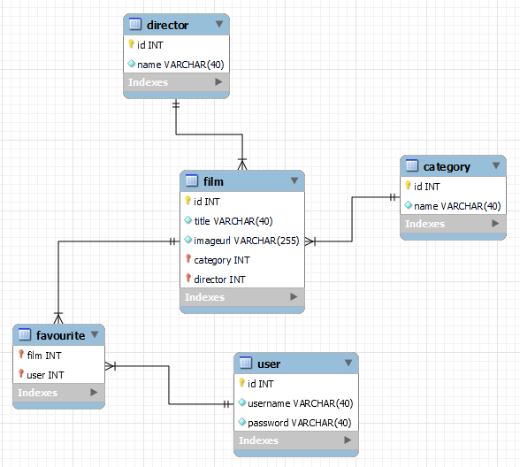

# Многостраничное Backend-приложение на Symfony

## <a href="http://167.99.255.113:5555/">Перейти на сайт</a>

## Схема

## Цель

Научиться разрабатывать многостраничное Backend-приложение с использованием стека технологий: Nginx, PHP-fpm, Composer,
Symfony, Doctrine.

## Теоретическая часть

https://getcomposer.org/

https://symfony.com/

https://www.doctrine-project.org/

https://symfony.com/doc/current/setup.html

## Постановка задачи

Реализовать многостраничное web-приложение. Минимальный стек технологий для приложения: Nginx, PHP-fpm, Symfony (+
аутентификация пользователей), Doctrine (5 сущностей, 1 отношение многие-ко-многим, 1 отношение один-ко-многим, CRUD).
Обязательно использование пакетного менеджера Composer, а также решение нетривиальной задачи (например, загрузка
изображений или калькулятор на основе данных из БД).

## Порядок выполнения

1. Анализ задачи.
2. Исследование источников.
3. Подготовить предметную область, содержащую как минимум 5 сущностей с хотя бы одним отношением 1:N и одним N:N.
4. Реализовать php-приложение с использованием фреймворка Symfony.
5. Реализовать аутентификацию пользователей.
6. Разработать решение нетривиальной задачи.

## Форма отчета

Репозиторий на GitHub с исходным кодом проекта и описанием, web-страница в интернете.
